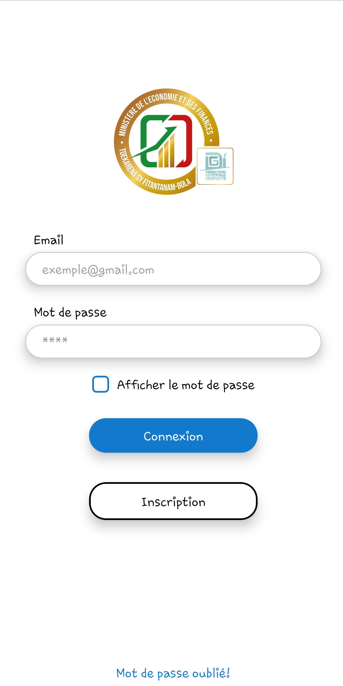
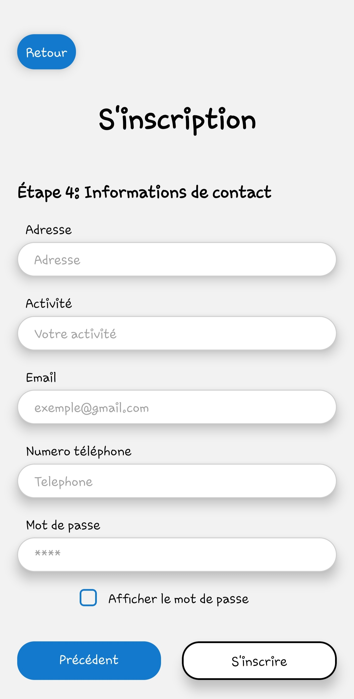
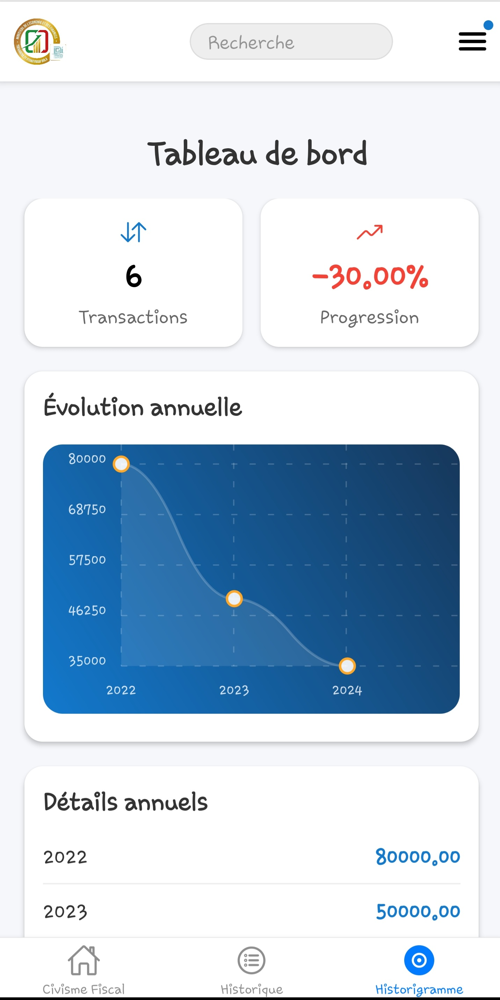
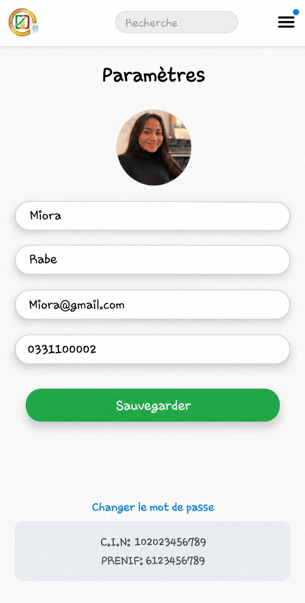

# 🧾 Application mobile d'immatriculation fiscale en ligne

Application mobile permettant aux personnes physiques de s'immatriculer fiscalement en ligne et de consulter leurs transactions dans un espace contribuable.

Projet réalisé pour la **Direction Générale des Impôts (DGI)** de Madagascar, au sein du Service du Système d'Information Fiscale (SSIF), dans le cadre d'un stage de 3 mois.

> Mémoire de fin d'études — Licence professionnelle, mention Informatique, parcours Informatique Générale
> École Nationale d'Informatique (ENI), Université de Fianarantsoa — année universitaire 2023-2024

---

## 🎯 Contexte et objectif

Aujourd'hui, un contribuable doit se déplacer au centre fiscal pour déposer son dossier d'immatriculation. Lors de l'activité *ANJARA HETRAKO*, les agents de la DGI se déplacent et procèdent à l'immatriculation de façon manuelle, sur papier.

Un logiciel en ligne existe déjà (NIFONLINE). Il est sécurisé et efficace, mais :

- il n'est pas conçu pour les personnes sans activité professionnelle ;
- il est jugé trop complexe et demande beaucoup de temps ;
- certaines étapes de vérification des dossiers sont encore faites par des agents.

**Objectif :** augmenter le nombre de contribuables à Madagascar, notamment parmi les travailleurs informels, en rendant l'immatriculation simple et accessible depuis un téléphone.

---

## ✨ Fonctionnalités

Les cas d'utilisation sont classés par ordre de priorité :

| Priorité | Fonctionnalité | Acteur(s) | Description |
|---|---|---|---|
| 1 | S'authentifier | Contribuable | Connexion par e-mail et mot de passe, puis code de vérification à 6 chiffres envoyé par e-mail |
| 2 | S'inscrire | Contribuable | Inscription en ligne, avec vérification de l'identité (CIN, contact, nom) et obtention d'un numéro PRENIF |
| 3 | Visualiser ses transactions | Contribuable | Historique des transactions avec recherche, et tableau de bord avec histogramme annuel |
| 4 | Modifier ses informations | Contribuable | Modification du profil, de la photo et du mot de passe depuis la page Paramètres |
| 5 | Envoyer un message | Contribuable, administrateur | Questions et demandes d'aide au service d'aide |
| 6 | Réinitialiser son mot de passe | Contribuable | Vérification de l'identité (CIN, e-mail, numéro), puis code envoyé par e-mail |
| 7 | Gérer les contribuables et les messages | Administrateur | Recherche d'un contribuable par PRENIF, consultation des messages et réponse |
| 8 | Civisme fiscal | Contribuable | Consultation de contenus éducatifs (description, questions/réponses, quiz) |

> **PRENIF :** numéro unique attribué à chaque contribuable pour l'identification fiscale.

---

## 📱 Aperçu

<table>
  <tr>
    <td align="center"><b>Connexion</b><br><br></td>
    <td align="center"><b>Inscription</b><br><br></td>
    <td align="center"><b>Historique</b><br><br></td>
    <td align="center"><b>Paramètres</b><br><br></td>
  </tr>
</table>

> Captures réalisées avec des **données fictives** (voir « Données de démonstration »).

---

## 🏗️ Architecture

L'application suit une **architecture 3-tiers** et communique par une **API REST** (échanges en JSON).

```text
┌─────────────────────────────┐
│  Couche présentation        │
│  React Native + Expo Go     │
└──────────────┬──────────────┘
               │  API REST (JSON)
               ▼
┌─────────────────────────────┐
│  Couche métier              │
│  Django (Python)            │
└──────────────┬──────────────┘
               │  ORM
               ▼
┌─────────────────────────────┐
│  Couche données             │
│  PostgreSQL                 │
└─────────────────────────────┘
```

---

## 🛠️ Technologies utilisées

| Domaine | Choix | Alternative comparée dans le mémoire |
|---|---|---|
| Application mobile | React Native (testée avec Expo Go) | Flutter |
| Backend | Python + Django + Django REST Framework | Flask, FastAPI |
| Base de données | PostgreSQL (administrée avec pgAdmin 4) | MySQL |
| Authentification | Token avec expiration (contribuables) ; DRF `TokenAuthentication` (administrateurs) | — |
| E-mail | SMTP Gmail, pour le code de vérification | — |
| Méthode de conception | UP (Processus Unifié) | Merise |
| Modélisation | UML, avec Visual Paradigm | — |
| Éditeur | Visual Studio Code | — |

Les versions exactes des dépendances Python sont figées dans `backend/requirements.txt`.

---

## 📁 Structure du dépôt

Principaux éléments :

```text
apk-prenif/
├── backend/
│   ├── myApp/                    # configuration Django (settings, urls)
│   ├── users/
│   │   ├── api/                  # vues, serializers, authentification par token, urls
│   │   ├── management/commands/  # commande seed_demo (données de démonstration)
│   │   ├── migrations/
│   │   └── models.py             # contribuable, transactions, messages, tokens...
│   ├── sql/
|   |   ├── nif.sql               # le base de donnée 
│   │   └── vues.sql              # vues SQL à créer après les migrations
│   ├── manage.py
│   ├── requirements.txt
│   └── .env.example              # modèle de configuration (à copier en .env)
├── frontend/                     # application mobile (React Native + Expo Router)
│   ├── app/
│   │   ├── (tabs)/               # écrans de l'application (voir le tableau ci-dessous)
│   │   └── _layout.tsx           # navigation principale
│   ├── assets/                   # images et polices
│   ├── components/
│   ├── constants/
│   ├── hooks/
│   ├── app.json
│   ├── package.json
│   └── .env                      # adresse de l'API (EXPO_PUBLIC_API_URL), non versionné
├── docs/                         # captures d'écran affichées dans ce README
│   ├── connexion.png
│   ├── inscription.png
│   ├── historique.png
│   └── parametres.png
└── README.md
```

Écrans de l'application mobile (`frontend/app/(tabs)/`) :

| Fichier | Écran |
|---|---|
| `log_in.jsx` | connexion |
| `sign_up.jsx` | inscription |
| `motDePasse.jsx` | mot de passe oublié |
| `accueil.jsx` | accueil |
| `historique.jsx` | historique des transactions |
| `histogramme.jsx` | tableau de bord (histogramme annuel) |
| `chat.jsx` | messages avec le service d'aide |
| `parametre.jsx` | profil, photo et mot de passe |
| `deconnexion.jsx` | déconnexion |
| `apropos.jsx` | à propos |
| `Admin*.jsx` | écrans administrateur (messages, chat) |

---

## 🧠 Modèle de données

Les principales données gérées sont le **contribuable**, ses **transactions** et ses **messages**.

Règles de gestion :

- **RG1 :** un contribuable a un et un seul numéro PRENIF ;
- **RG2 :** un contribuable peut avoir un ou plusieurs contacts ;
- **RG3 :** un contribuable peut faire une ou plusieurs transactions ;
- **RG4 :** un contribuable peut envoyer un ou plusieurs messages.

Données conservées pour un contribuable : identité (nom, prénom, sexe, date et lieu de naissance, situation familiale), CIN (numéro, date et lieu de délivrance), contact, adresse e-mail, lieu de résidence, numéro PRENIF, mot de passe (haché) et photo.

Données conservées pour une transaction : identifiant, mode de paiement, montant à payer, numéro de quittance.

Tables principales de la base :

- `contribuable`, `operateur`, `messages` ;
- `central_recette` (transactions issues des logiciels de la DGI), `paiement`, `mode_paiement`, `num_impot`, `logiciel` ;
- `auth_token_contribuable` et `verification_code` (authentification) ;
- un découpage territorial (pays, région, ville, localité, wereda, fokontany).

Trois **vues SQL** alimentent l'historique des transactions, le tableau de bord et les messages : `vue_somme_par_contribuable_par_annee`, `vue_detail_transactions_par_quit_et_contribuable` et `vue_messages`. Les modèles Django correspondants sont en `managed = False` : **les migrations ne créent pas ces vues**, elles doivent être créées avec `backend/sql/vues.sql` (voir Installation).

---

## 🔒 Sécurité

- **Connexion en deux étapes :** mot de passe, puis code à 6 chiffres envoyé par e-mail (valable 10 minutes, 5 essais maximum, usage unique, seul un hash est conservé).
- **Tokens à durée limitée :** 7 jours pour les contribuables, révoqués au changement ou à la réinitialisation du mot de passe.
- **Permissions par rôle :** chaque route est réservée aux contribuables ou aux administrateurs ; un contribuable ne peut lire que ses propres données (filtrage par l'utilisateur authentifié, jamais par un identifiant envoyé par le client).
- **Mots de passe :** hachés par Django (PBKDF2), avec règle de complexité (lettre, chiffre, caractère spécial) ; jamais renvoyés par l'API.
- **Routes publiques limitées :** inscription, connexion, vérification du code et réinitialisation du mot de passe sont limitées à 10 requêtes par minute.
- **Inscription contrôlée :** le CIN, le contact et le nom doivent correspondre à un opérateur enregistré (tolérance de 2 caractères sur les noms).
- **Secrets hors du code :** clé secrète, accès à la base et identifiants e-mail sont lus depuis un fichier `.env` non versionné.

---

## 🚀 Installation

### Prérequis

- Python 3.12 ou plus récent, et `pip`
- PostgreSQL (avec pgAdmin 4, par exemple)
- Node.js et `npm`
- L'application **Expo Go** installée sur le téléphone
- Un compte Gmail avec un **mot de passe d'application** (pour l'envoi des codes)

### Récupérer le projet

```bash
git clone https://github.com/Ranto-nyaina/Immatriculation_fiscale_en_ligne
cd Immatriculation_fiscale_en_ligne
```

### 1. Backend

```bash
cd backend
python -m venv venv
source venv/bin/activate      # sous Windows : venv\Scripts\activate
pip install -r requirements.txt

cp .env.example .env          # sous Windows : copy .env.example .env
```

Remplis ensuite le fichier `.env` :

| Variable | Rôle |
|---|---|
| `DJANGO_SECRET_KEY` | clé secrète Django (obligatoire) |
| `DJANGO_DEBUG` | `True` en développement uniquement |
| `DJANGO_ALLOWED_HOSTS` | hôtes autorisés ; ajoute l'IP locale du PC pour tester depuis un téléphone |
| `CORS_ALLOWED_ORIGINS` | seulement si tu testes depuis un navigateur ; sinon laisse vide |
| `DB_NAME`, `DB_USER`, `DB_PASSWORD`, `DB_HOST`, `DB_PORT` | accès à PostgreSQL (`DB_HOST=127.0.0.1` ; vérifie ton port, souvent 5432 ou 5433) |
| `EMAIL_HOST_USER`, `EMAIL_HOST_PASSWORD` | compte Gmail pour l'envoi du code ; utilise un **mot de passe d'application** |

Pour générer une clé secrète :

```bash
python -c "from django.core.management.utils import get_random_secret_key as g; print(g())"
```

Crée une base PostgreSQL **vide** (nommée `nif` par défaut), puis :

```bash
python manage.py migrate
```

Crée ensuite les trois vues SQL. Sans elles, l'historique, le tableau de bord et les messages ne fonctionnent pas :

```bash
python manage.py shell -c "from django.db import connection; connection.cursor().execute(open('sql/vues.sql', encoding='utf-8').read()); print('Vues créées')"
```

(Équivalent avec `psql` : `psql -U postgres -d nif -f sql/vues.sql`.) Ces vues ont été reconstruites à partir des modèles Django, car les définitions d'origine ont été perdues : la logique retenue est décrite dans les commentaires du script.

Crée un compte administrateur, puis lance le serveur :

```bash
python manage.py createsuperuser
python manage.py runserver 0.0.0.0:8000
```

**Deux types d'accès à l'API :**

- **contribuables :** en-tête `Authorization: Bearer <token>`, obtenu après la connexion en deux étapes ;
- **administrateurs :** en-tête `Authorization: Token <token>`, pour un compte Django `is_staff`, obtenu par la route `admin-login/`.

Les routes disponibles sont définies dans `backend/users/api/urls.py`.

### 2. Données de démonstration (optionnel)

Pour tester sans vraies données, une commande crée des données **fictives** (logiciels, modes de paiement, impôts, deux opérateurs) :

```bash
python manage.py seed_demo
```

Elle affiche les CIN et contacts fictifs à utiliser pour t'inscrire dans l'application. Une fois inscrit, ajoute des paiements de démonstration à ton compte (remplace par ton PRENIF, renvoyé à l'inscription) :

```bash
python manage.py seed_demo --prenif <ton_prenif>
```

La commande peut être relancée sans créer de doublons. Ne l'utilise jamais avec de vraies données de contribuables.

### 3. Application mobile

```bash
cd frontend
npm install
```

Crée le fichier `frontend/.env` avec l'adresse de l'API (remplace par l'IP locale de ton PC, visible avec `ipconfig` sous Windows) :

```text
EXPO_PUBLIC_API_URL=http://192.168.1.10:8000/api
```

Ajoute cette même IP dans `DJANGO_ALLOWED_HOSTS` du fichier `backend/.env`, puis lance :

```bash
npx expo start --clear
```

Scanne le code QR avec Expo Go. Le téléphone et l'ordinateur doivent être sur le même réseau Wi-Fi, et le pare-feu doit autoriser Python sur les réseaux privés. Avec un émulateur Android, l'adresse de l'API est `http://10.0.2.2:8000/api`.

---

## ⚠️ Limites du projet

- L'application n'est décrite que dans un environnement de développement (Expo Go) : aucun déploiement en production n'est documenté ;
- aucun test automatisé n'est fourni dans le dépôt ;
- les vues SQL sont une reconstruction : leur logique (année de paiement, une ligne par paiement) doit être validée avant tout usage réel ;
- l'application stocke des données personnelles sensibles (CIN, photo, contacts, transactions) : leur protection doit être vérifiée et documentée avant tout usage réel ;
- les tokens des administrateurs (DRF standard) n'expirent pas : un token volé reste valide tant qu'il n'est pas supprimé ;
- le PRENIF est calculé à partir du CIN : il est prévisible et ne doit jamais servir de secret ;
- la photo de profil est stockée en base64 dans la base de données ;
- le changement d'adresse e-mail depuis le profil ne demande pas de nouvelle vérification par code ;
- la limitation de débit utilise le cache local de Django : en production, un cache partagé serait nécessaire ;
- l'envoi des codes passe par Gmail (quota quotidien limité) ;
- la configuration fournie est prévue pour le développement (base locale, `DEBUG` activable) : un profil de production (HTTPS, hôtes, base dédiée) reste à écrire ;
- l'application cible les personnes physiques uniquement (pas les entreprises).

---

## 🚀 Perspectives d'amélioration

- déployer le backend et publier l'application (Android / iOS) ;
- ajouter des tests unitaires et d'intégration ;
- séparer la configuration développement / production et activer HTTPS ;
- exiger un nouveau code lors du changement d'adresse e-mail ;
- stocker les photos comme fichiers plutôt qu'en base64 ;
- utiliser des tokens à durée limitée pour les administrateurs ;
- étendre l'application aux personnes morales.

---

## 📚 Compétences mises en œuvre

- Analyse de l'existant et conception UML (cas d'utilisation, diagrammes de séquence et de classes, déploiement)
- Développement mobile multiplateforme (React Native)
- Développement backend et API REST (Python, Django)
- Sécurisation d'une API (authentification par token, code de vérification, permissions par rôle)
- Modélisation et administration d'une base de données (PostgreSQL)
- Gestion de projet en environnement professionnel (stage à la DGI)

---

## 👨‍🎓 Contexte académique

- **Auteur :** FANOMEZANTSOA Rantoniaina Harlivah
- **Établissement :** École Nationale d'Informatique (ENI), Université de Fianarantsoa
- **Diplôme :** Licence professionnelle — Informatique, parcours Informatique Générale
- **Lieu du stage :** Direction Générale des Impôts (DGI), Service du Système d'Information Fiscale
- **Soutenance :** 5 février 2025

---

## 📌 Conclusion

Ce projet propose une chaîne complète, de l'analyse de l'existant à la réalisation d'une application mobile : **Inscription → Obtention du PRENIF → Suivi des transactions → Échange avec le service d'aide**, pour faciliter l'immatriculation fiscale des personnes physiques.

Sa valeur repose sur une démarche de bout en bout, avec une transparence assumée sur ses limites : vues SQL reconstruites, environnement de développement uniquement, et protection des données personnelles à valider avant tout usage réel.
